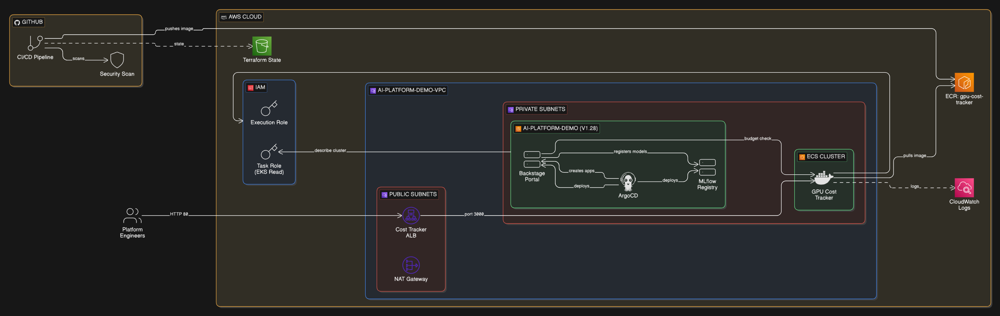

# AI ML Developer Platform

A hybrid AWS platform that gives ML engineers self-service access to GPU resources, model deployment, and cost tracking — combining EKS for platform services with ECS Fargate for lightweight microservices.

## Overview

Organisations running ML workloads face a recurring tension: data scientists need fast access to GPU resources, but unrestricted provisioning leads to spiralling cloud costs. This platform solves both sides by integrating a developer portal (Backstage), model registry (MLflow), and a custom GPU cost tracker into a single, GitOps-managed infrastructure.

The architecture uses a hybrid compute approach. EKS runs the heavier platform services — ArgoCD manages deployments, Backstage provides self-service templates for GPU provisioning and model deployment, and MLflow handles experiment tracking and model registration. A custom-built GPU Cost Tracker runs on ECS Fargate, deliberately separated to demonstrate cost-optimised service placement — a simple Node.js dashboard doesn't need Kubernetes overhead.

Everything is provisioned through Terraform and deployed via GitHub Actions. ArgoCD watches the repo and automatically syncs Helm-based deployments to the cluster, while the CI/CD pipeline handles container builds with Trivy security scanning before pushing to ECR.

## Architecture

The system operates across two compute planes within a single VPC. Public subnets host the Application Load Balancer for the cost tracker, while all workloads run in private subnets behind a NAT gateway. EKS nodes host ArgoCD, Backstage, and MLflow in separate namespaces. The ECS Fargate task pulls its container image from ECR and sends logs to CloudWatch. Backstage templates communicate with both MLflow (for model registration) and the cost tracker (for budget checks and GPU allocation) via internal service endpoints. The ECS task role has read-only access to the EKS cluster, allowing the cost dashboard to surface cluster-level GPU metrics.

## Tech Stack

**Infrastructure**: AWS EKS, ECS Fargate, VPC (multi-AZ), ALB, ECR, CloudWatch, IAM, S3 (Terraform state)

**CI/CD**: GitHub Actions, ArgoCD (GitOps), Helm

**Platform Services**: Backstage (developer portal), MLflow (model registry)

**Application**: Node.js, Express, Chart.js

**Security**: Trivy container scanning, ECR scan-on-push, private subnets, least-privilege IAM roles

**IaC**: Terraform with AWS community modules (VPC, EKS)

## Key Decisions

- **Hybrid EKS + ECS Fargate**: The cost tracker is a stateless Node.js service — running it on Fargate avoids dedicating Kubernetes resources to a lightweight dashboard. This mirrors a real-world pattern where not every service justifies cluster overhead.

- **ArgoCD over direct Helm deploys**: GitOps provides drift detection and self-healing. Backstage templates create ArgoCD applications rather than running `helm install`, keeping the cluster state declarative and auditable.

- **Backstage as the control plane**: Instead of giving engineers direct `kubectl` access, the platform exposes GPU provisioning and model deployment through Backstage templates with built-in budget checks — enforcing cost controls before resources are allocated.

- **Single NAT gateway**: A deliberate cost optimisation for a demo environment. In production, this would be one-per-AZ for high availability, but the architecture is structured to make that a single-variable change.

## Screenshots

**Backstage Developer Portal** — The self-service portal login screen with guest access option. This is the control plane where engineers request GPU resources and model deployments through templated workflows, rather than directly accessing Kubernetes.

**ArgoCD GitOps Dashboard** — Applications view showing two Helm deployments (Backstage and MLflow) with healthy status and recent sync records. ArgoCD automatically syncs these applications from the Git repository, providing drift detection and audit trails for all cluster changes.

**MLflow Experiment Tracking** — The experiments view in dark mode showing the MLflow 3.2.0 interface with a "Default" experiment created on 08/11/2025. This is where data scientists log their training runs and manage model versions for the registry.

**GPU Cost Tracker Dashboard** — A Node.js/Chart.js dashboard displaying real-time metrics: total spend ($2453.67), GPU resource allocation across instance types, and a cost breakdown chart by compute cluster. This runs on ECS Fargate to demonstrate cost-optimized service placement.

## Author

**Noah Frost**

- Website: [noahfrost.co.uk](https://noahfrost.co.uk)
- GitHub: [github.com/nfroze](https://github.com/nfroze)
- LinkedIn: [linkedin.com/in/nfroze](https://linkedin.com/in/nfroze)
